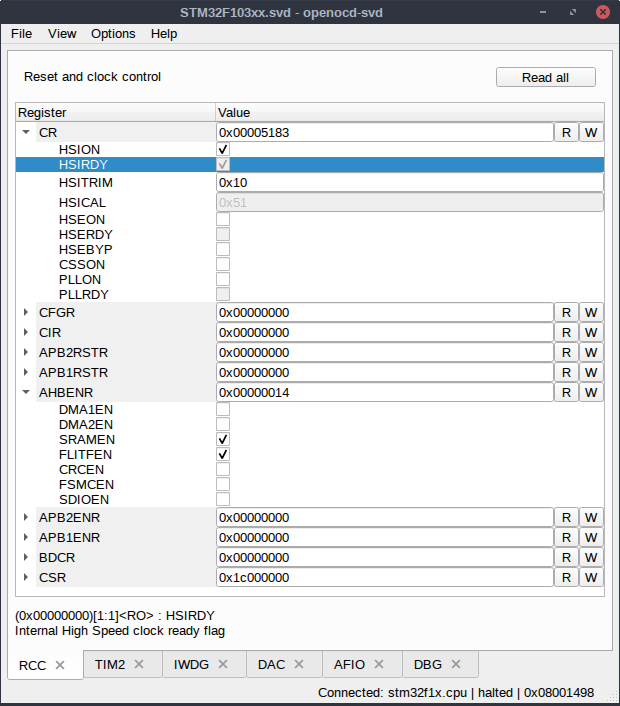

## What is openocd-svd?

openocd-svd is a Python-based GUI utility to access peripheral registers of ARM MCUs via combination of [OpenOCD](http://openocd.org/) and [CMSIS-SVD](http://cmsis.arm.com/).



## Features

- several ways to open SVD:
    - command line argument
    - standart file dialog
    - special dialog where any SVD from [cmsis-svd](https://github.com/posborne/cmsis-svd) can be chosen
- tree view for SVD registers and fields
- any value can be displayed in hex, dec or bin form (right click to choose)
- SVD clusters, cluster and register arrays supported (only flat view)
- SVD enums supported
- separate tabs for peripherals
- auto-polling openocd connection every 1s: get current MCU state and PC
- auto-read option to read registers when MCU halted and PC changed (manual read by default)
- auto-write option to write register immediately after it changed (manual write by default)

## Dependencies

- [Python 3+](https://www.python.org/downloads/)
- [openocd](http://openocd.org/)
- [PyQt5](https://pypi.org/project/PyQt5/)
- [cmsis-svd](https://github.com/posborne/cmsis-svd) parser

## How to use

- Find and download SVD file with peripheral register structure of your MCU (can be found in Google, vendor site or [cmsis-svd](https://github.com/posborne/cmsis-svd) repo)
- Connect MCU with OpenOCD any way you like (GDB, raw scripts, etc)
- Start openocd-svd and open SVD file (or pass path to SVD as first argument at start)
- Press Connect to access OpenOCD via telnet interface (localhost 4444)
- use View menu to access peripheral registers you want

Run (SVD path argument is optional):
```
python3 openocd_svd.py %svd_file_path%
```
